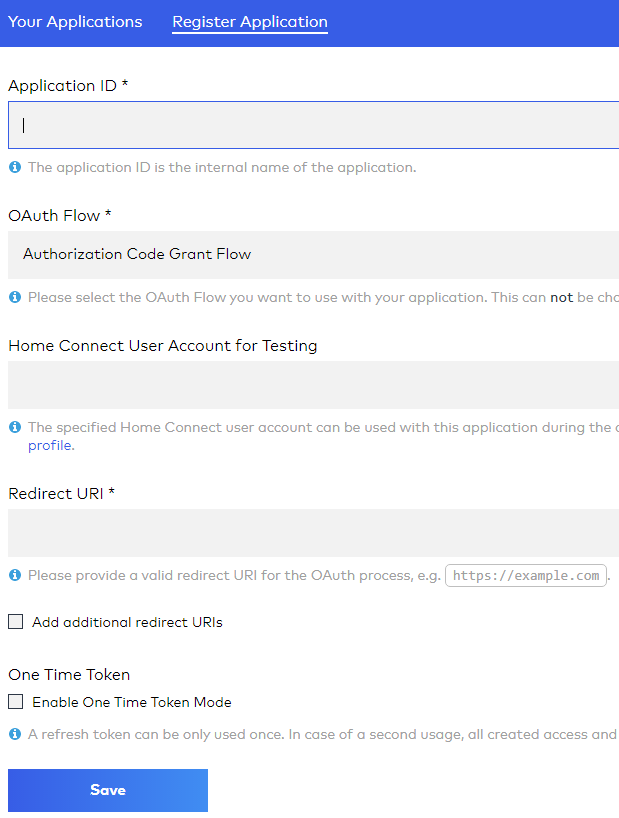

Support me with a coffee https://www.buymeacoffee.com/flopp999 or use my Tibber link https://tibber.com/se/invite/8af85f51  
Please use my Tibber invite code, then we both get SEK 500, to use in Tibber shop. https://tibber.com/se/invite/8af85f51
---
Create a folder with name "HomeConnect" in "domoticz/plugins"  
Put plugin.py, requirements.txt in that folder

or

Run in domoticz/plugins "sudo git clone https://github.com/flopp999/HomeConnect-Domoticz HomeConnect"  
Run "cd HomeConnect"
Run "pip3 install -r requirements.txt" to install all packages that this plugin needs

---
You need to have some information to be able to use this plugin: 

First create an account here https://developer.home-connect.com/  
Then Application -> Register Application

Explain for the photo:  
Application ID can be anything  
OAuth Flow shall be Authorization Code Grant Flow  
Home Connect User.... can be empty  
Redirect URi can be any address as long as it exists  

[Client ID](https://github.com/flopp999/HomeConnect-Domoticz/blob/main/README.md#Identifier,-Secret-and-URL)  
[Client Secret](https://github.com/flopp999/HomeConnect-Domoticz/blob/main/README.md#Identifier,-Secret-and-URL)  
[Redirect RUi](https://github.com/flopp999/HomeConnect-Domoticz/blob/main/README.md#Identifier,-Secret-and-Callback-URL)  
[Authorization Code](https://github.com/flopp999/HomeConnect-Domoticz/blob/main/README.md#System-ID)  
[Refresh Token](https://github.com/flopp999/HomeConnect-Domoticz/blob/main/README.md#Charge-from-your-electricity-company)  
[Access code](https://github.com/flopp999/HomeConnect-Domoticz/blob/main/README.md#Access-code)

# Client ID, Client Secret and Redirect URi
Login to [NIBE Uplink API](https://api.nibeuplink.com/)  
Create an application under My Applications  
For Callback URL use "https://api.nibeuplink.com/"  
Copy Identifier, Secret and Callback URL, paste to NIBEUplink hardware in Domoticz  

# System ID
Login to [NIBE Uplink](https://nibeuplink.com/)  
When logged in, look at the address bar, "https://w<i></i>ww.nibeuplink.com/System/xxxxxx/Status/Overview", xxxxxx is your System ID  
Copy your System ID and paste to NIBEUplink hardware in Domoticz  

# Charge from your electricity company
You need to add the total extra charge your electricity company have, without taxes  
e.g. Tibber have SEK 1.55 at the moment  

# Access code
You need to create an Access code before first use  
Click on the link below, you will get an error, that is OK  
https://api.nibeuplink.com/oauth/authorize?client_id=yyyyyy&scope=READSYSTEM&state=x&redirect_uri=https://api.nibeuplink.com/&response_type=code  
Once you clicked it, in the address bar change yyyyyy to your Identifier, NOT YOUR SYSTEM ID!!!  
Then it will ask you to login and accept.  
When this is done the address bar will look something like below  
"https://api.nibeuplink.com/?code=ndfhj3u38ufhswhnerjqa5zEyN-RmBgkTCc&state=x"  
Copy everything after "...code=" and before "&state...", the code above is just an example, normally the code is ~380 characters
Above example have access code "ndfhj3u38ufhswhnerjqa5zEyN-RmBgkTCc"

Support me with a coffee https://www.buymeacoffee.com/flopp999 or use my Tibber link https://tibber.com/se/invite/8af85f51
